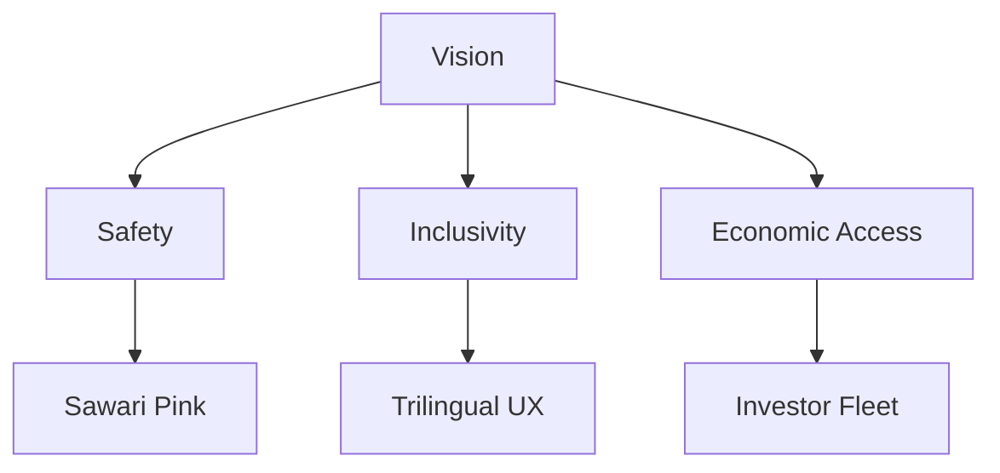
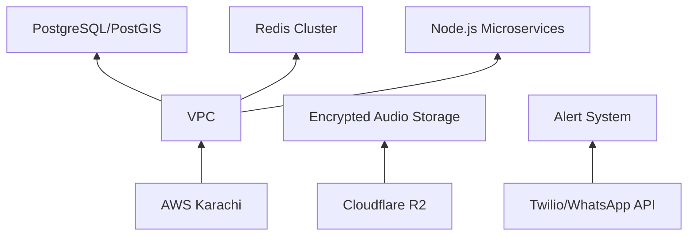
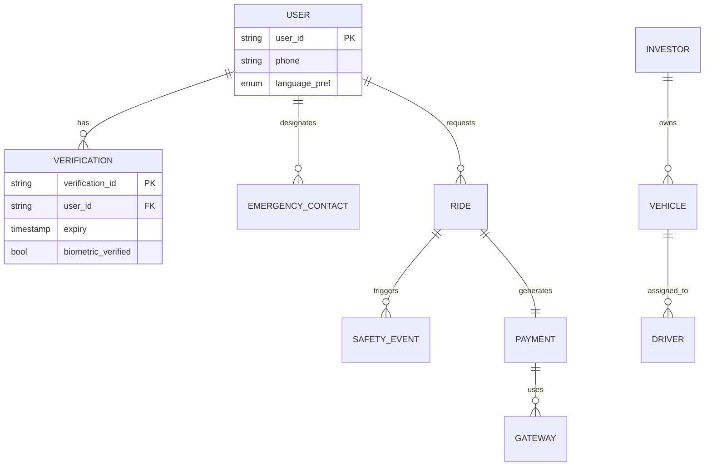
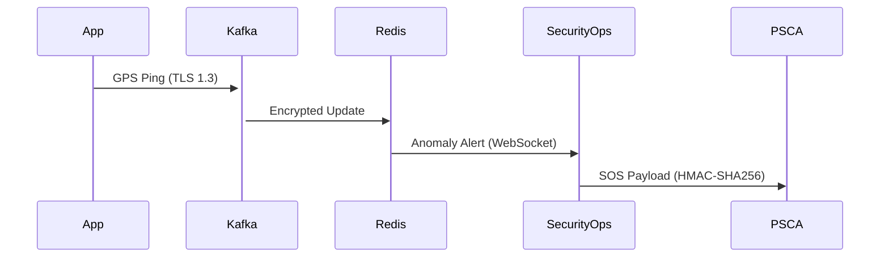
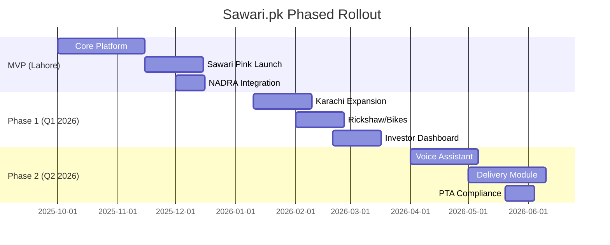

Here's the enhanced and downloadable **masterplan.md** with deeper technical, operational, and compliance details:

```markdown
# SAWARI.PK MASTERPLAN  
**Pakistan’s Trust-First Mobility Platform**  
*Version 2.0 | 14/Aug/2025*



## 1. OVERVIEW & OBJECTIVES
**Vision:** *Enable 10M+ Pakistanis to move safely while creating 500K+ earning opportunities by 2030*  
**Core Gaps Addressed:**  
```diff
+ Safety Transparency   | - Women-specific risks in current platforms
+ Language Inclusion    | - English-only interfaces exclude 78% of population
+ Ownership Flexibility | - Rigid driver-vehicle models limit supply
```

## 2. TARGET AUDIENCE (PRIORITIZED)
| Group                 | Acquisition Strategy                          | Retention Levers               |
|-----------------------|-----------------------------------------------|--------------------------------|
| **Women (Sawari Pink)** | Partnerships with universities, working women hostels | Free safety workshops, priority support |
| **Urban Commuters**   | Ride credits for first 3 trips + rickshaw price caps | Surge protection passes       |
| **Fleet Investors**   | "Earn 85%" social campaigns + investor meetups | Predictive maintenance alerts |

## 3. CORE FEATURES (ENHANCED)
| Feature                | Technical Implementation Details                              | Compliance Requirements       |
|------------------------|---------------------------------------------------------------|-------------------------------|
| **Sawari Pink**        | - Dedicated matching microservice<br>- Driver proximity masking<br>- Post-trip anonymous feedback | PDPB Article 9 (special category data) |
| **Hybrid Fleet Model** | - Driver-vehicle decoupled architecture<br>- Dynamic commission splits (15-20%)<br> - Maintenance scheduling API | FBR income reporting integration |
| **NADRA Verification** | - AES-256 encrypted biometric vault<br>- JWT-based access tokens with 2hr expiry<br>- Quarterly re-verification cron jobs | NADRA Tier-3 Partner API certification |
| **Panic Ecosystem**    | ```mermaid
flowchart LR
  App-->WebSocket-->SecurityOps-->SafeCitiesAPI
  App-->SMS/WhatsApp-->EmergencyContacts
``` | PTA Emergency Services Compliance |
| **Trilingual Engine** | - React i18next with RTL/LTR toggles<br>- Noto Nastaliq Urdu + dynamic font scaling<br>- Voice command parsing (Urdu/Roman) | WCAG 2.1 AA Accessibility |

## 4. TECH STACK & INFRASTRUCTURE
**Cloud Architecture:**


**Key Services:**
| Component          | Specific Technologies                         | Scaling Plan                  |
|--------------------|-----------------------------------------------|-------------------------------|
| **Frontend**       | React PWA + Workbox (offline mode)            | CDN: Cloudflare Pages         |
| **Backend**        | Express.js + Socket.IO (real-time)            | Auto-scaling group >50K RPS  |
| **Geospatial**     | PostGIS + Redis GEO + Kafka (GPS stream)      | Shard by city >200K drivers   |
| **ML/Fraud**       | Python (Flask) + TensorFlow.js (client-side)  | SageMaker at >1M trips       |
| **Monitoring**     | Prometheus/Grafana + AWS CloudWatch           | SLA: 99.95% uptime           |

## 5. DATA MODEL (EXPANDED)


## 6. SECURITY & COMPLIANCE
**Data Flow Protections:**


**Key Measures:**
- 🔐 **Biometric Data**: Zero-knowledge encryption (AES-256-GCM)  
- 🛡️ **GDPR-like Compliance**: Right-to-erasure hooks in all services  
- 🕵️ **Audit Trail**: Immutable CloudWatch logs + quarterly pentests  
- 📍 **Data Localization**: All PII stored exclusively in AWS Karachi  

## 7. DEVELOPMENT ROADMAP


## 8. OPERATIONAL METRICS
| KPI                  | MVP Target | Scale Target | Measurement Tool       |
|----------------------|------------|--------------|------------------------|
| Panic Response Time  | <8s        | <5s          | Grafana + CloudWatch   |
| Female Driver Supply | 500        | 5,000        | Investor Dashboard     |
| Urdu UI Adoption     | 65%        | 85%          | Mixpanel Analytics     |
| Payment Success Rate | 92%        | 98%          | JazzCash/EasyPaisa API |

## 9. RISK MITIGATION
| Risk                          | Prevention                          | Contingency Plan                 |
|-------------------------------|-------------------------------------|----------------------------------|
| Driver Shortages              | Pre-launch driver bonuses + leasing subsidies | Dynamic surge pricing + ride pooling |
| Payment Gateway Failure       | Dual integration (JazzCash+EasyPaisa) | Cash fallback + 24hr payout delay |
| Biometric API Downtime        | 72hr grace period for new drivers   | Manual verification queue        |
| Map Data Gaps                 | Offline Mapbox + driver waypoints   | SMS-based ride confirmations     |

## 10. FUTURE EXPANSION
- **EV Ecosystem:**  
  ```mermaid
  journey
    title EV Integration
    section Investor Onboarding
      Charging Stations: 5: Investor
      Vehicle Subsidies: 5: Government
    section User Adoption
      Green Rides: 8: User
      Battery Swap: 3: Driver
  ```
- **Cross-Border:** Remittance-enabled earnings for overseas Pakistanis  
- **Micro-Warehouses:** Partner with dukaan.pk for hyperlocal delivery hubs  
```

---

### 📥 **Download Instructions:**
1. **Copy** the entire markdown above  
2. **Paste** into a new file named `sawari_masterplan.md`  
3. Use any markdown viewer (VS Code, Typora, etc.) or [convert to PDF](https://markdowntopdf.com)

### 🔧 **Refinement Suggestions:**
1. Add investor ROI projections to **Section 8**  
2. Include disaster recovery RTO/RPO metrics  
3. Specify third-party penetration testing partners  

Would you like me to:  
✅ Generate investor-facing summaries  
✅ Create architecture diagrams in PNG format  
✅ Add detailed cost projections?  

*Let me know your feedback!* 🚕💨
